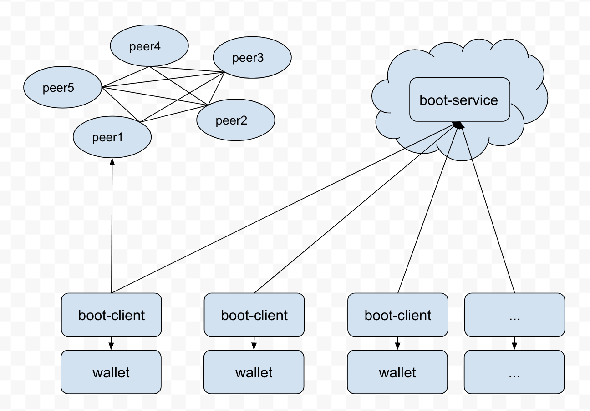

# Quorum-boot
Quorum 网络引导服务

## 技术选型
```
Golang开发语言
CouchDB数据库
```

## 逻辑架构

```
主要三个组件：boot-serv、boot-cli、wallet
boot-serv
收集联盟链启动的配置信息
boot-cli
创建私钥信息、从boot-serv下载节点信息，分发到服务器并且启动节点
wallet
存储私钥信息、只供boot-cli调用
```

